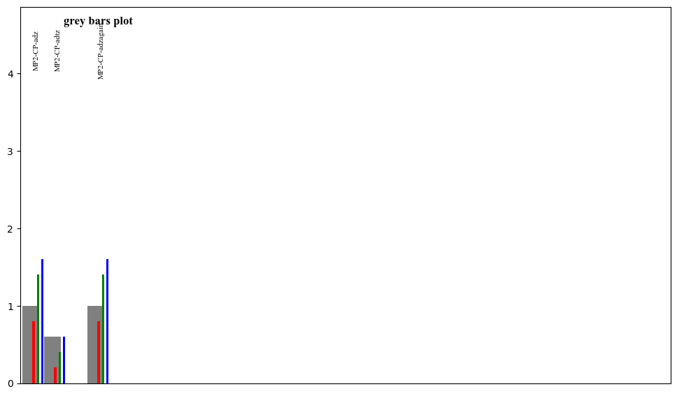
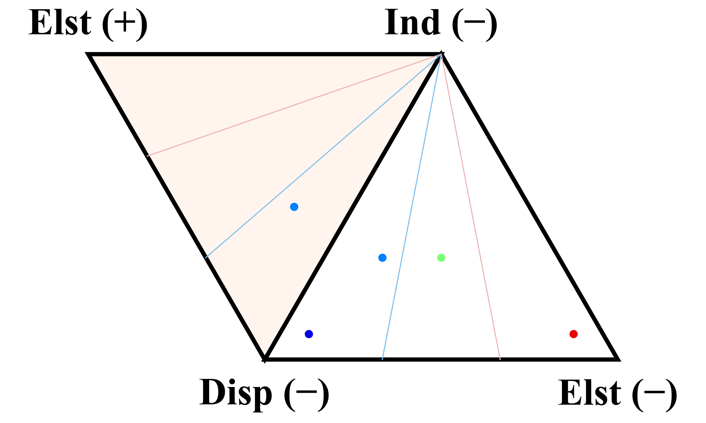

# paper-figure-tools
Code to generate figures and tables for publication,
including thread diagrams and LaTeX tables including
such thread diagrams.

# Installation
1. clone this repo `git clone https://github.com/SherrillGroup/paper-figure-tools.git`
2. Install locally in developer mode `pip install -e paper-figure-tools`

# Usage
## Thread tables
1.
```python
import cdsg_plot

cdsg_plot.qcdb_plot.flat(
    data,
    color='blue',
    view=False,
    title=f"{i}_total_error",
    xlimit=20.0,
)
merge_dats = [
    {
        "show": "a",
        "db": "HSG",
        "sys": "1",
        "data": [0.3508, 0.1234, 0.0364, 0.0731, 0.0388],
    },
    {
        "show": "b",
        "db": "HSG",
        "sys": "3",
        "data": [0.2036, -0.0736, -0.1650, -0.1380, -0.1806],
    },
    {
        "show": "c",
        "db": "S22",
        "sys": "14",
        "data": [None, -3.2144, None, None, None],
    },
    {
        "show": "d",
        "db": "S22",
        "sys": "15",
        "data": [-1.5090, -2.5263, -2.9452, -2.8633, -3.1059],
    },
    {
        "show": "e",
        "db": "S22",
        "sys": "22",
        "data": [0.3046, -0.2632, -0.5070, -0.4925, -0.6359],
    },
]

threads(
    merge_dats,
    labels=["d", "t", "dt", "q", "tq"],
    color="sapt",
    title="MP2-CPa[]z",
    mae=[0.25, 0.5, 0.5, 0.3, 1.0],
    mape=[20.1, 25, 15, 5.5, 3.6],
)
```

## Gallery

### cdsg_plot

aka (C. David Sherrill Group Plotting Tools)

* "grey bars" plots for matplotlib
  - Defined in [src/cdsg_plot/qcdb_plot.py](src/cdsg_plot/qcdb_plot.py) .
  - Demo in [src/cdsg_plot/grey_bars.py](src/cdsg_plot/grey_bars.py) .
  - 

* "ternary" plots for matplotlib and plotly
  - Defined for plotly in src/cdsg_plot/ternary.py](src/cdsg_plot/ternary.py) .
  - Defined for matplotlib in `ternary` function in [src/cdsg_plot/qcdb_plot.py](src/cdsg_plot/qcdb_plot.py) .
  - Demo of both in [src/cdsg_plot/ternary.py](src/cdsg_plot/ternary.py) .
  - 
  - 

* next


